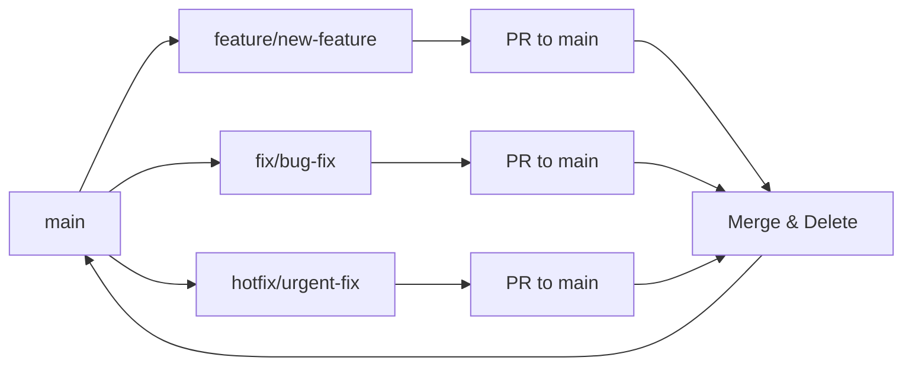

# Branch Naming Convention Design

## Overview

This design establishes a comprehensive branch naming convention that provides clear categorization, descriptive naming, and optional issue tracking integration. The convention follows the pattern: `<type>/<description>[-issue-number]`

## Architecture

### Branch Type Prefixes

The convention uses standardized prefixes to categorize different types of work:

- **`feature/`** - New functionality or enhancements
- **`fix/`** or **`bugfix/`** - Bug fixes (both accepted, `fix/` preferred for brevity)
- **`hotfix/`** - Urgent production fixes that bypass normal development flow
- **`refactor/`** - Code restructuring without changing functionality
- **`docs/`** - Documentation updates
- **`chore/`** - Maintenance tasks, CI/CD, tooling, dependencies
- **`experiment/`** - Experimental or proof-of-concept work
- **`release/`** - Release preparation branches

### Naming Structure

**Format:** `<type>/<description>[-<issue-number>]`

**Components:**
1. **Type prefix** - Indicates the category of work
2. **Forward slash** - Separator between type and description
3. **Description** - Brief, descriptive name using kebab-case
4. **Issue number** - Optional GitHub issue reference with hyphen prefix

## Components and Interfaces

### Branch Type Categories

#### Development Branches
- `feature/` - For new features, enhancements, or significant additions
- `experiment/` - For experimental work, spikes, or proof-of-concepts

#### Maintenance Branches  
- `fix/` - For bug fixes and corrections
- `hotfix/` - For urgent production fixes
- `refactor/` - For code improvements without functional changes

#### Support Branches
- `docs/` - For documentation updates
- `chore/` - For maintenance tasks, tooling, CI/CD updates
- `release/` - For release preparation and version bumps

### Naming Guidelines

#### Description Format
- Use **kebab-case** (lowercase with hyphens)
- Be descriptive but concise (aim for 2-5 words)
- Focus on **what** is being done, not **how**
- Avoid abbreviations unless widely understood

#### Issue Integration
- Append issue number with hyphen: `-123`
- Use GitHub issue numbers when available
- External ticket references acceptable: `-JIRA-456`

## Data Models

### Branch Name Examples

```
# Feature branches
feature/user-authentication
feature/grid-world-visualization-15
feature/multi-agent-pathfinding

# Bug fixes
fix/memory-leak-in-simulation
fix/grid-rendering-performance-42
bugfix/agent-collision-detection

# Hotfixes
hotfix/security-vulnerability-patch
hotfix/critical-crash-fix-89

# Refactoring
refactor/agent-class-hierarchy
refactor/simplify-grid-calculations-67

# Documentation
docs/api-reference-update
docs/installation-guide-improvements

# Chores
chore/update-dependencies
chore/setup-github-actions-ci
chore/add-eslint-configuration

# Experiments
experiment/webgl-rendering-poc
experiment/machine-learning-agents-23

# Releases
release/v1.2.0
release/v2.0.0-beta
```

### Branch Lifecycle



## Error Handling

### Invalid Branch Names
- Names not following the convention should be flagged during code review
- Git hooks could be implemented to validate branch names (optional)
- Clear error messages should guide developers to correct format

### Naming Conflicts
- If similar branch names exist, append additional context
- Use issue numbers to differentiate when possible
- Consider more specific descriptions

### Legacy Branches
- Existing branches may remain unchanged
- New work should follow the convention
- Major branches (main, develop) are exempt from the convention

## Testing Strategy

### Validation Approach
1. **Documentation Review** - Ensure examples cover common scenarios
2. **Team Training** - Educate team members on the convention
3. **Code Review Enforcement** - Check branch names during PR reviews
4. **Optional Automation** - Git hooks for automatic validation

### Success Metrics
- Consistent branch naming across the project
- Reduced confusion about branch purposes
- Easier branch discovery and filtering
- Improved project organization

### Implementation Guidelines
1. Document the convention in project README
2. Create examples for common scenarios
3. Update any existing development documentation
4. Consider adding to PR template as a checklist item
5. Optionally implement git hooks for validation

## Branch Protection Rules

### Recommended Protections
- **main** - Require PR reviews, status checks
- **release/** - Require PR reviews, restrict direct pushes
- **hotfix/** - Allow emergency access but require post-merge review

### Cleanup Strategy
- Delete feature branches after successful merge
- Keep release branches for historical reference
- Archive experiment branches or convert to tags if successful

## Post-Merge Workflow

### Standard Workflow After PR Merge

After a pull request is merged, developers should follow this workflow to stay synchronized:

```bash
# 1. Switch back to main branch
git checkout main

# 2. Pull latest changes from remote
git pull origin main

# 3. Delete the local feature branch (optional but recommended)
git branch -d feature/branch-name

# 4. Verify you're up to date
git status
```

### Automated Cleanup Commands

For convenience, this can be combined into a single workflow:

```bash
# Complete post-merge cleanup
git checkout main && git pull origin main && git branch -d feature/old-branch-name
```

### Branch Cleanup Best Practices

1. **Always return to main** after PR merge
2. **Pull immediately** to get latest changes
3. **Delete merged branches** to keep local repo clean
4. **Verify status** before starting new work
5. **Create new branches from updated main**

### Integration with Development Tools

- Consider adding post-merge hooks or scripts
- IDE extensions can automate this workflow
- Git aliases can simplify the command sequence