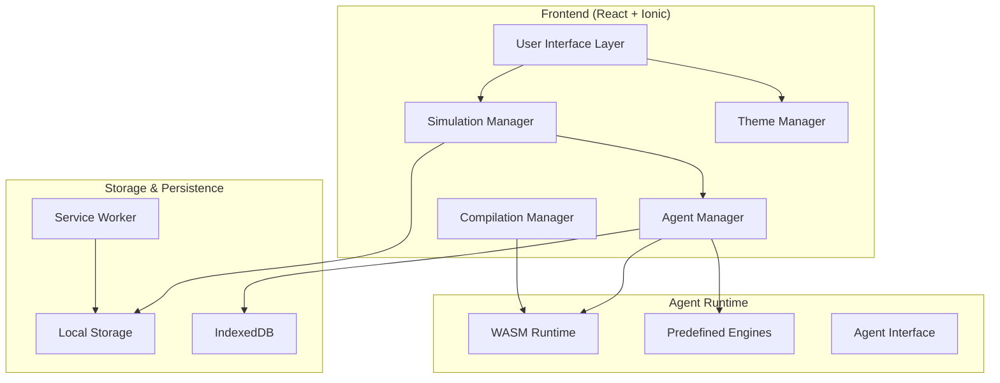

# Design Document

## Overview

The Multi-Agent Grid World PWA is a React-based Progressive Web App built with Ionic Framework that provides a mobile-first simulation environment for multi-agent systems. The application features a grid-based world where users can deploy various types of agents (predefined, WASM-based, or Rust-compiled) and observe their interactions in real-time.

The architecture emphasizes accessibility, mobile responsiveness, and extensibility through a plugin-based agent system that supports multiple programming languages and compilation targets.

## Architecture

### High-Level Architecture



### Component Architecture

The application follows a modular component architecture with clear separation of concerns:

- **Presentation Layer**: Ionic React components with accessibility features
- **Business Logic Layer**: Simulation engine, agent management, and compilation services
- **Data Layer**: Local storage for preferences, IndexedDB for agent code and examples
- **Runtime Layer**: WebAssembly execution environment for custom agents

## Components and Interfaces

### Core Components

#### 1. Grid World Component (`GridWorld.tsx`)
- Renders the simulation grid using HTML5 Canvas or SVG for performance
- Handles touch interactions and zoom/pan gestures for mobile
- Implements accessibility features with ARIA live regions for screen readers
- Supports responsive sizing based on viewport

#### 2. Agent Manager (`AgentManager.ts`)
```typescript
interface IAgentManager {
  loadPredefinedAgent(type: AgentType): Promise<Agent>;
  loadWasmAgent(wasmModule: ArrayBuffer): Promise<Agent>;
  compileRustAgent(rustCode: string): Promise<Agent>;
  validateAgent(agent: Agent): boolean;
  getAvailableAgents(): Agent[];
}
```

#### 3. Simulation Engine (`SimulationEngine.ts`)
```typescript
interface ISimulationEngine {
  initialize(gridSize: GridDimensions): void;
  addAgent(agent: Agent, position: Position): void;
  step(): void;
  play(): void;
  pause(): void;
  reset(): void;
  getState(): SimulationState;
}
```

#### 4. Compilation Service (`CompilationService.ts`)
- Integrates with rust-wasm-bindgen for in-browser Rust compilation
- Provides error handling and user-friendly compilation feedback
- Manages compilation cache for performance

#### 5. Configuration Panel (`ConfigPanel.tsx`)
- Responsive layout: split pane on desktop, collapsible drawer on mobile
- Real-time configuration updates
- Form validation and user input handling

#### 6. Preferences Manager (`PreferencesManager.ts`)
```typescript
interface IPreferencesManager {
  setTheme(theme: ThemeType): void;
  getTheme(): ThemeType;
  setAccessibilityOptions(options: AccessibilityOptions): void;
  getAccessibilityOptions(): AccessibilityOptions;
  persistPreferences(): void;
}
```

### Agent Interface

All agents must implement a standardized interface for consistent execution:

```typescript
interface Agent {
  id: string;
  name: string;
  type: AgentType;
  step(worldState: WorldState, agentState: AgentState): AgentAction;
  initialize?(config: AgentConfig): void;
  cleanup?(): void;
}

interface AgentAction {
  type: 'move' | 'wait' | 'communicate' | 'custom';
  direction?: Direction;
  message?: string;
  customData?: any;
}
```

## Data Models

### Core Data Structures

#### Grid World State
```typescript
interface WorldState {
  grid: Cell[][];
  agents: Map<string, AgentState>;
  dimensions: GridDimensions;
  tick: number;
}

interface Cell {
  type: CellType;
  occupant?: string; // Agent ID
  properties?: CellProperties;
}

interface AgentState {
  id: string;
  position: Position;
  health: number;
  energy: number;
  inventory?: Item[];
  customState?: any;
}
```

#### Configuration Models
```typescript
interface SimulationConfig {
  gridSize: GridDimensions;
  tickRate: number;
  maxAgents: number;
  worldRules: WorldRules;
}

interface AccessibilityOptions {
  theme: 'light' | 'dark' | 'high-contrast';
  fontSize: 'small' | 'medium' | 'large';
  reducedMotion: boolean;
  screenReaderOptimized: boolean;
}
```

## Error Handling

### Compilation Error Handling
- Rust compilation errors are parsed and presented with line numbers and suggestions
- WASM loading errors provide clear feedback about module compatibility
- Graceful fallbacks when compilation services are unavailable

### Runtime Error Handling
- Agent execution errors are isolated to prevent simulation crashes
- Network errors for PWA features have offline fallbacks
- User input validation with accessible error messages

### Accessibility Error Prevention
- Form validation with ARIA live regions for screen reader feedback
- Color contrast validation for custom themes
- Keyboard navigation error recovery

## Testing Strategy

### Unit Testing
- Jest for React component testing with React Testing Library
- Agent interface compliance testing
- Compilation service unit tests with mock WASM modules

### Integration Testing
- End-to-end simulation workflows
- PWA functionality testing (offline mode, installation)
- Cross-browser compatibility testing

### Accessibility Testing
- Automated accessibility testing with axe-core
- Screen reader testing with NVDA/JAWS
- Keyboard navigation testing
- Color contrast validation

### Performance Testing
- Grid rendering performance with large numbers of agents
- WASM compilation and execution benchmarks
- Mobile device performance profiling
- Memory usage monitoring for long-running simulations

### Mobile Testing
- Touch interaction testing on various screen sizes
- PWA installation and offline functionality
- Battery usage optimization testing
- Network condition simulation (slow 3G, offline)

## Technical Implementation Details

### PWA Features
- Service Worker for offline functionality and caching
- Web App Manifest for installation and app-like experience
- Background sync for saving simulation states
- Push notifications for long-running simulations (optional)

### Ionic Integration
- Ionic React components for native-like UI elements
- Ionic theming system for accessibility compliance
- Capacitor integration for potential native app deployment
- Platform-specific optimizations (iOS/Android)

### WebAssembly Integration
- rust-wasm-bindgen for Rust to WASM compilation
- WASM module validation and sandboxing
- Memory management for WASM instances
- Performance optimization for frequent agent execution

### Responsive Design
- CSS Grid and Flexbox for adaptive layouts
- Ionic breakpoint system for responsive behavior
- Touch-friendly sizing (minimum 44px touch targets)
- Viewport meta tag optimization for mobile devices